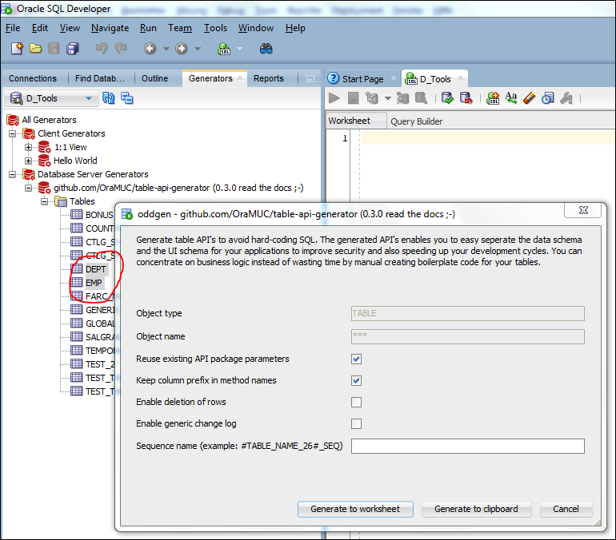

# Table API Generator - Development Branch 0.5-dev - Current Status

## To Do

- New parameter `p_enable_custom_defaults BOOLEAN DEFAULT FALSE`:
  - To do: create_a_row with single column pk and given sequence name
  - New method `create_a_row` with (custom) default parameters
    - If new parameter `p_custom_column_defaults xmltype default null` is null then the table column defaults are used, otherwise the provided custom defaults
    - XMLTYPE because we need to save this parameter in the API spec for parameterless recreation and also this gives us the possibility to define some dynamic content like in the example below (the XML is very simple and since JSON is commonly used these days this xml should not be a problem for a developer
    - Additional reason is the SQL Developer integration - there we have only a reduced set of input types
    - Two new helper functions to retrieve automatically useful defaults:
    - `util_get_custom_col_defaults`
    - `util_table_row_to_xml`
    - The second one is used in the first one and the first one is a incomplete first implementation which could be used as a template for your own business needs - please see also the spec and body for implementation details; For the table EMPLOYEES the result works fine - see usage example below;
- Move generic change log table creation to a utility function? To be discussed; The problem here was the support of varchar2 natural primary keys like an ISO currency code, which could not be saved in a number based pk_id column; Maybe be we should let the users create the generic change log table and they should decide, if the pk_id column should be of type number or varchar2, and if varchar2 how many characters should be stored in the id column - this depends heavily on the data model
- Align oddgen wrapper package for SQL Developer integration
- When using `p_col_prefix_in_method_names => false` then do NOT throw an exception when no unique column prefix is found for a table? To be discussed
- List also dml_v and trigger status in all apis view
- Delete_row (by uk) functions ?
- Update documentation
- Create tests with utplsql, Travis and SonarQube
  - Provide a stable set of test tables and data
  - Test all combinations of column defaults
  - ...
- Something else?
- ...

## Done

Special thanks to Jacek Gębal (github.com/jgebal), Peter Ettinger (github.com/pettinger) and PaoloM (github.com/softinn72) for the valuable feedback in several issues. That is the way how open source software works :-)

- New branch `0.5`
- Support for multi column primary keys:
  - NOT generated: get_pk_by_unique_cols functions - use instead read_row functions, which are also overloaded with unique constraint params and returning the whole row
  - NOT supported: use of generic change log (p_enable_generic_change_log)
- New paramter `p_enable_column_defaults BOOLEAN DEFAULT FALSE`: Add the column defaults of the table to the `create_row` methods
- New Parameter `p_exclude_column_list VARCHAR2 DEFAULT NULL`: A list of comma separated column names, which should be excluded on inserts and updates (virtual columns are implicitly excluded); Note that the excluded columns are included in all return values and possible getter methods and also can be submitted with the row based insert and update methods (values will be ignored, sure)
- New parameter `p_api_name VARCHAR2 DEFAULT NULL` to control the API name
  - Extended substitutions for the SQL Developer multi API generation like `#TABLE_NAME_17#_API` or better `#TABLE_NAME_4_20#_API` also for the parameter `p_sequence_name`
  - Additional Info:
  - `#TABLE_NAME_17#` is treated as substr(1, 17)
  - `#TABLE_NAME_4_20#` is treated as substr(4, 20)
  - Negative positions also possible like `#TABLE_NAME_-20_20#` (length can NOT be ommitted because of use case with one number and backward compatibility, we had only `#TABLE_NAME_26#`, `#TABLE_NAME_28#`...)
- New method `read_a_row` without any parameter to read the first record from the table (one cursor fetch)
- New parameter `enable_getter_and_setter boolean default true`
- New parameter `enable_parameter_prefixes boolean default true`
- New parameter `return_row_instead_of_pk boolean default false`
- New parameter `enable_proc_with_out_params boolean default true`: these procedures are created mainly for APEX to directly bind page items to the API without any other code - since not anyone is using APEX this can now be disabled
- New Parameter `p_owner all_users.username%type default user` to be able to create APIs in other schemas
- Rework pipelined table function `view_existing_apis` to be able to find also APIs with names other then `<TABLE_NAME>_API` since the API name is now changeable with the parameter `p_api_name`
- Additional supported data types by the helper functions `util_get_custom_col_defaults` and `util_table_row_to_xml` - now the following data types should working: `NUMBER`, `INTEGER`, `FLOAT`, `%CHAR%`, `DATE`, `TIMESTAMP` and with Dummy data `CLOB`, `BLOB`, `XMLTYPE`
- Changed signatur of the helper method create_change_log_entry with column type parameters to support also varchar2 pk_id values (needed for natural pk's like an ISO currency code)
- Enhanced template engine - Supports now dynamic substitutions:
  - Changed template placeholder from `#EXAMPLE_STATIC#` to `{{ EXAMPLE_STATIC }}` and ``, because `#` is a valid character in a column name
  - This was needed for the column compare list, which can be easily grow over 32k with only slightly more then one hundred columns
  - Switched all column lists to dynamic substitutions, because since DB release 12 we have 128 chars for a column, so normal column lists could also easily grow over 32k
  - Nicer output: lowercase paramaters and method names, lists with one entry per line and we tried to align the parameter definitions and mappings...
- Many rework in the background - mainly for the multi column primary keys; Thank you Peter ;-)

```xml
<defaults>
  <item><col>LAST_NAME</col><val>'Atkinson'</val></item>
  ...
</defaults>
```

```sql
-- usage of the helper om_tapigen.util_get_custom_col_defaults:
BEGIN
   om_tapigen.compile_api (
      p_table_name                    => 'EMPLOYEES',
      p_reuse_existing_api_params     => FALSE,
      p_col_prefix_in_method_names    => TRUE,
      p_enable_insertion_of_rows      => TRUE,
      p_enable_update_of_rows         => TRUE,
      p_enable_deletion_of_rows       => FALSE,
      p_enable_generic_change_log     => TRUE,
      p_enable_dml_view               => TRUE,
      p_sequence_name                 => 'EMPLOYEES_SEQ',
      p_api_name                      => 'EMPLOYEES_API',
      p_enable_getter_and_setter      => FALSE,
      p_enable_proc_with_out_params   => FALSE,
      P_enable_parameter_prefixes     => FALSE,
      p_return_row_instead_of_pk      => TRUE,
      p_exclude_column_list           => 'SALARY,COMMISSION_PCT'
      p_column_defaults               => om_tapigen.util_get_custom_col_defaults ('EMPLOYEES'));
END;
/
-- inspect the result of the helper
SELECT XMLSERIALIZE (
          DOCUMENT OM_TAPIGEN.UTIL_GET_CUSTOM_COL_DEFAULTS ('EMPLOYEES')
          INDENT)
  FROM DUAL;
```

---

Please do not download directly this code - this is the development version and can be unstable. You can find the [latest stable version here](https://github.com/OraMUC/table-api-generator/releases/latest).

# Table API Generator

*This generator is a standalone PL/SQL package which creates table API's for existing tables. It can be integrated in the Oracle SQL-Developer with an additional wrapper package for the [oddgen](https://www.oddgen.org/) extension. The effort of generated API's is to reduce your PL/SQL code by calling standard procedures and functions for usual DML operations on tables. So the generated table APIs work as a logical layer between your business logic and the data. And by the way this logical layer enables you to easily seperate the data schema and the UI schema for your applications to improve security by granting only execute privs on table APIs to the application scheme. In addition to that table APIs will speed up your development cycles because developers are able to set the focal point to the business logic instead of wasting time by manual creating boilerplate code for your tables.*

> Avoid hard-coding SQL ([Steven Feuerstein](https://www.toadworld.com/cfs-file/__key/communityserver-wikis-components-files/00-00-00-00-03/Say-Goodbye-to-Hard_2D00_Coding.pdf)\)

## Features

- Generates small wrappers around your tables
- You only need to specify generation options once per table - parameters are saved in the package spec source and can be reused for regeneration
- Standard CRUD methods (column and row type based) with an additional create or update version
- Getter and setter for each column
- A primary key based row exists boolean function and a row exists_yn varchar2 function that can be used in PL/SQL or SQL context
- per unique constraint a getter function to fetch the primary key by each unique constraint (single or multicolumn)
- Delete / Insert / Update of rows can be enabled or disabled e.g. to avoid deletion because of violation of referential integrity
- Optional generic logging (one log entry for each changed column over all API enabled schema tables in one generic log table - very handy to create a record history in the user interface)
- Checks for real changes during UPDATE operation and updates only if required
- Supports APEX automatic row processing by generation of an optional updatable view with an instead of trigger, which calls simply the API and if enabled - the generic logging

## How it looks like

See our generated [example API](example-api.md) on the demo table HR.EMPLOYEES.

## License

The MIT License (MIT)

Copyright (c) 2015-2016 André Borngräber, Ottmar Gobrecht

Permission is hereby granted, free of charge, to any person obtaining a copy of this software and associated documentation files (the "Software"), to deal in the Software without restriction, including without limitation the rights to use, copy, modify, merge, publish, distribute, sublicense, and/or sell copies of the Software, and to permit persons to whom the Software is furnished to do so, subject to the following conditions:

The above copyright notice and this permission notice shall be included in all copies or substantial portions of the Software.

THE SOFTWARE IS PROVIDED "AS IS", WITHOUT WARRANTY OF ANY KIND, EXPRESS OR IMPLIED, INCLUDING BUT NOT LIMITED TO THE WARRANTIES OF MERCHANTABILITY, FITNESS FOR A PARTICULAR PURPOSE AND NONINFRINGEMENT. IN NO EVENT SHALL THE AUTHORS OR COPYRIGHT HOLDERS BE LIABLE FOR ANY CLAIM, DAMAGES OR OTHER LIABILITY, WHETHER IN AN ACTION OF CONTRACT, TORT OR OTHERWISE, ARISING FROM, OUT OF OR IN CONNECTION WITH THE SOFTWARE OR THE USE OR OTHER DEALINGS IN THE SOFTWARE.

## Naming Conventions

The generator is creating the following objects for each table during the compilation phase (with the create or replace clause):

- `#TABLE_NAME_26#_API`: The API package itself
- `#TABLE_NAME_24#_DML_V`: An optional DML view, mainly a helper for APEX tabular forms
- `#TABLE_NAME_24#_IOIUD`: An optional instead of trigger on the DML view, which calls simply the table API

Additionally the generator is creating once in a schema a generic change log table if you set the parameter p_enable_generic_change_log to true:

- `GENERIC_CHANGE_LOG`: The table itself
- `GENERIC_CHANGE_LOG_SEQ`: The sequence
- `GENERIC_CHANGE_LOG_PK`: The primary key index
- `GENERIC_CHANGE_LOG_IDX`: An additional index

The generator is checking by itself, if the corresponding sequence and index names are already in use in the schema. If it is the case, an error is raised.

We think currently about a new parameter to enable or disable the generation of the view and the trigger. Not all of the projects require updatable DML views and you can also use the API methods on a tabular form directly (but the wizard driven tabular form creation is easier to implement with the DML view).

If you want to check if generated objects with their names already exist before the very first API compilation, you can use this pipelined table function:

```sql
SELECT *
  FROM TABLE(your_install_schema.om_tapigen.view_naming_conflicts);
```

We give our best to produce clean and robust code, but we are NOT responsible, if you loose any code or data by using this API generator. By using it you accept the MIT license as described above. As a best practice test this generator first in your development environment and decide after your tests, if you want to use it in production. If you miss any feature or find a bug, we are happy to hear from you via the GitHub [issues](http://semver.org/) functionality.

## How To Use

1. Install the package om_tapigen in your schema, or even better in a central tools schema and grant execute rights to public
1. Optional install the wrapper package for the SQL Developer integration (don't forget to install the [oddgen](https://www.oddgen.org/) extension)
1. Create your API's :-)

### PL/SQL

```sql
begin
  --> minimal parameter, see also the section "The Parameters"
  your_install_schema.om_tapigen.compile_api (p_table_name => 'EMP');
end;
```

#### The Methods

There are three methods - all have the same parameters:

1. compile_api: This procedure generates the code and compiles it directly
1. compile_api_and_get_code: This functions does the same as the previous procedure and returns additionally the generated code as a clob
1. get_code: This function only returns the code as a clob (this is the function called by the oddgen wrapper for the SQL Developer integration)

There is also a pipelined function to view the current status of the API's and the original parameter values from the generation call:

```sql
SELECT *
  FROM TABLE(your_install_schema.om_tapigen.view_existing_apis)
 ORDER BY table_name NULLS FIRST;
```

The leading dictionary information is the API package name. It could be, you found API's where the table_name is NULL - this means your API is existing, but your table not anymore. Thats the reason for the order by clause in the example query. You can use this pipelined function for quality assurance or for building a metadata repository with the generation parameters of your API's. It also used by the second helper method, a procedure to recreate all existing API's at once with the original parameter values in case of changes in your data model:

```sql
BEGIN
  your_install_schema.om_tapigen.recreate_existing_apis;
END;
```

As you can see, you need no parameters for this procedure - they are taken from the dictionary user source, because we save it as a comment in the package specification. If you ask, why not use package constants we want ask you: Have you already tried to read a package constant when the package is invalid because of changes in your corresponding table... ;-)

#### The Parameters

- p_table_name: string, mandatory
- p_reuse_existing_api_params: boolean, default true
  - If true, all following parameters are ignored, if the generator can find the original parameters in the package specification of the existing API - for new API's this parameter is ignored and the following parameters are used
  - If false, the generator ignores any existing API options and you are able to redefine the parameters
- p_col_prefix_in_method_names: boolean, default true
  - The generator is generally shorten your column names to 26 characters to build the names for the column based getter and setter methods (get_xxx, set_xxx)
  - If true, the generator does no other modifications
  - If false, the generator tries to find a unique column prefix for all the colums in your table
  - If he find one, this column prefix is first deleted from your column name before building the short name with 26 characters
  - If he could not find a column prefix, then the generator throws an exception (should we simple ignore this? let us know...)
- p_enable_insertion_of_rows: boolean, default true
  - selfexplanatory, isn't it?
  - If true, then create_row procedure and function is generated
  - If true and parameter p_enable_update_of_rows is true, then create_or_update_row procedure and function is generated
  - If false, then create_row and create_or_update_row procedure and function is NOT generated
  - If false, then the corresponding DML view(`#TABLE_NAME_24#_DML_V`) instead of trigger (`#TABLE_NAME_24#_IOIUD`) raises an exception on an insert attempt
- p_enable_update_of_rows: boolean, default true
  - selfexplanatory, isn't it?
  - If true, then update_row procedure is generated
  - If true and parameter p_enable_insertion_of_rows is true, then create_or_update_row procedure and function is generated
  - If false, then create_row and create_or_update_row procedure and function is NOT generated
  - If false, then setter procedures for each columns are NOT generated
  - If false, then the corresponding DML view(`#TABLE_NAME_24#_DML_V`) instead of trigger (`#TABLE_NAME_24#_IOIUD`) raises an exception on an update attempt
- p_enable_deletion_of_rows: boolean, default false
  - selfexplanatory, isn't it?
  - If true, then a delete_row procedure is generated
  - If false, then the delete_row procedure is NOT generated
  - If false, then the corresponding DML view(`#TABLE_NAME_24#_DML_V`) instead of trigger (`#TABLE_NAME_24#_IOIUD`) raises an exception on a delete attempt
- p_enable_generic_change_log: boolean, default false
  - If true, one log entry is created for each changed column over all API enabled schema tables in one generic log table - very handy to create a record history in the user interface
  - The table generic_change_log and a corresponding sequence generic_change_log_seq is created in the schema during the API creation on the very first API that uses this feature
  - We could long describe this feature - try it out in your development system and decide, if you want to have it or not
  - One last thing: This could NOT replace a historicization, but can deliver things, that would not so easy with a historicization - we use both sometimes together...
- p_enable_dml_view: boolean, default false
  - If true, an updatable view named `#TABLE_NAME_24#_DML_V` is created as logical layer above the database table
  - If true, a view trigger named `#TABLE_NAME_24#_IOIUD` is created to handle DML operations on the view
  - If false, view and trigger are NOT generated
- p_sequence_name: string, default null
  - If a sequence name is given here, then the resulting API is taken the ID for the create_row methods and you don't need to create a trigger for your table only for the sequence handling
  - you can use the following substitution strings, the generator is replacing this at runtime: `#TABLE_NAME_24#`, `#TABLE_NAME_26#`, `#TABLE_NAME_28#`, `#PK_COLUMN_26#`, `#PK_COLUMN_28#`, `#COLUMN_PREFIX#`
  - Example 1: `#TABLE_NAME_26#_SEQ`
  - Example 2: `SEQ_#PK_COLUMN_26#`
  - Example 3: `#COLUMN_PREFIX#_SEQ`

Finally a complete PL/SQL example with all default parameter values:

```sql
--> check for possible naming conflicts
SELECT *
  FROM TABLE(your_install_schema.om_tapigen.view_naming_conflicts);

--> initial API generation for your tables
BEGIN
  FOR i IN (SELECT table_name FROM user_tables /*WHERE...*/) LOOP
    your_install_schema.om_tapigen.compile_api(
      p_table_name                 => i.table_name,
      p_reuse_existing_api_params  => FALSE,
      p_col_prefix_in_method_names => TRUE,
      p_enable_insertion_of_rows   => TRUE,
      p_enable_update_of_rows      => TRUE,
      p_enable_deletion_of_rows    => FALSE,
      p_enable_generic_change_log  => FALSE,
      p_enable_dml_view            => FALSE,
      p_sequence_name              => NULL);
  END LOOP;
END;

--> inspect the results
SELECT *
  FROM TABLE(your_install_schema.om_tapigen.view_existing_apis)
 ORDER BY table_name NULLS FIRST;

--> recreate the API's after changes in your model
BEGIN
  your_install_schema.om_tapigen.recreate_existing_apis;
END;
```

If you want only generate the code, you can do it like so:

```sql
DECLARE
  v_clob CLOB;
BEGIN
  FOR i IN (SELECT table_name FROM user_tables) LOOP
    v_clob := your_install_schema.om_tapigen.get_code(
      p_table_name => i.table_name);
    dbms_xslprocessor.clob2file(
      v_clob,
      '<your_directory>',
      substr(i.table_name, 1, 26) || '_API.sql');
  END LOOP;
END;
```

### SQL Developer

Please install first the [oddgen](https://www.oddgen.org/) extension. Our wrapper package is autodiscovered by this extension.



### Recommended Fastest Way To Your API's

1. Check naming conflicts in your schema before the first API compilation
  - `SELECT * FROM TABLE(your_install_schema.om_tapigen.view_naming_conflicts);`
1. Use SQL Developer for the first API creation (you can create API's for multiple tables at once - see screenshot above: emp and dept)
1. Inspect and run the generated code as a script, then save it to your version control system for the deployment
1. View the state of all existing API's
  - `SELECT * FROM TABLE(your_install_schema.om_tapigen.view_existing_apis);`
1. On model changes recreate all existing API's with the original parameters
  - `BEGIN your_install_schema.om_tapigen.recreate_existing_apis; END;`

## Links

- [Download latest version](https://github.com/OraMUC/table-api-generator/releases/latest)
- [Issues](https://github.com/OraMUC/table-api-generator/issues)

## Credits

We want to say thank you to Phillip Salvisberg and all other people behind the [oddgen](https://www.oddgen.org/) project for this great generic SQL Developer extension. Also big thanks to Steven Feuerstein for his engagement to tell PL/SQL Developers, what a good coding practice is. We hope he find not so much bad practice in our generator, if he ever takes a look at it ;-)

## Changelog

This project uses [semantic versioning](http://semver.org/).

Please use for all comments, discussions, feature requests or bug reports the GitHub [issues](https://github.com/OraMUC/table-api-generator/issues) functionality.

### 0.4.1 (2017-05-27)

- Fixes #5: Parameter with PK is not used to insert - thanks to Jacek Gębal to report this issue

### 0.4.0 (2017-03-30)

#### new generated API functions / procedures

- adding a **row_exists_yn** function that returns 'Y' or 'N', same functionality as the existing **row_exists** function but allows to check a row within SQL context
- adding additional **read_row** functions that takes unique constraint columns as parameter and returns the row, for each unique constraint one read_row function
- **new enable INSERT, UPDATE, DELETE parameter** for fine granular definition, which DML operations are allowed on the table
- optional DML view as logical layer above the database table. This can be used in e.g. in APEX instead of the table to create forms, interactive grids etc AND to ensure, that table API is used
- optional DML view trigger that additionally catches unallowed DML operations and throws exceptions in dependency of **new enable INSERT, UPDATE, DELETE parameter**

#### code optimizations

- getter functions for each column: remove unnecessary variable declaration (variable v_return)
- setter functions for each column: remove unnecessary variable declaration (variable v_#column_name#)
- limit clause for bulk collect operations introduced to avoid session memory conflicts

#### other stuff

- added some additional comments on internal procedures and functions
- renaming internal variables more consistently
- supporting special column names, by using quotes around column names and validating / converting parameter names

### 0.3.0 (2016-07-03)

- First public release
- André: Complete redesign with global package collections and initialisation phase to avoid many dictionary queries
- Ottmar: Integration of all dependencies as package utilities, template engine to avoid many replace statements, integration in SQL-Developer, save parameters in source code for easy recreation

### 0.2.0 (not published)

- André: Read row procedure for APEX with out parameters for the page items, rowtype based methods
- Ottmar: Generic change log, get pk by unique columns function, idea for rowtype based methods

### 0.1.0 (not published)

- André: Idea and first running version
- Ottmar: Fan of the idea and first usage in a project :-)
