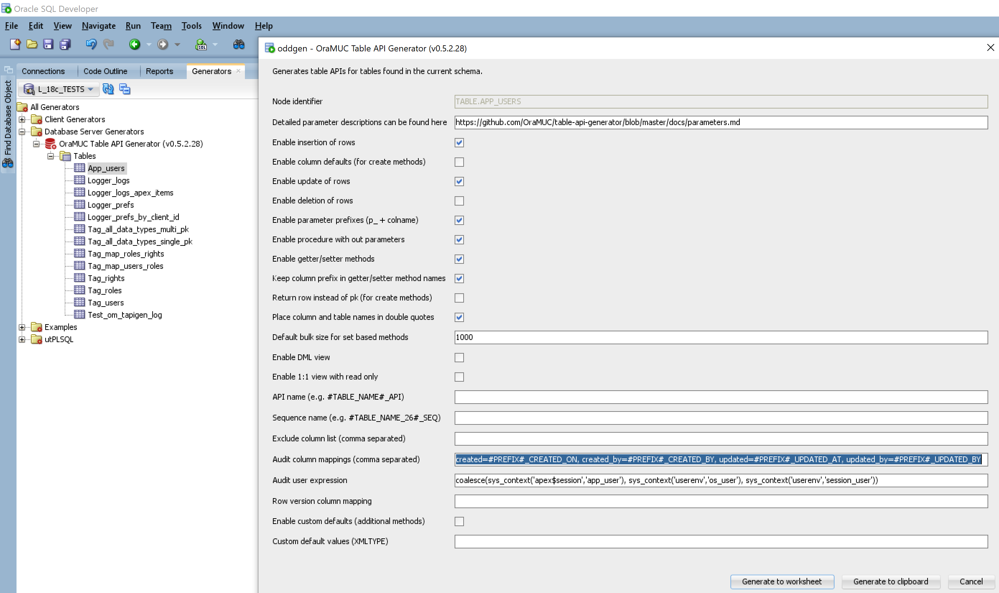

<!-- nav -->

[Index](README.md)
| [Changelog](changelog.md)
| [Getting Started](getting-started.md)
| [Parameters](parameters.md)
| [Naming Conventions](naming-conventions.md)
| [Bulk Processing](bulk-processing.md)
| [Example API](example-api.md)

<!-- navstop -->

# Example API

<!-- toc -->

- [Table Definition](#table-definition)
- [API Generation](#api-generation)
- [Package Specification](#package-specification)
- [Package body](#package-body)

<!-- tocstop -->

## Table Definition

```sql
create table app_users (
  au_id          integer            generated always as identity,
  au_first_name  varchar2(15 char)                         ,
  au_last_name   varchar2(15 char)                         ,
  au_email       varchar2(30 char)               not null  ,
  au_active_yn   varchar2(1 char)   default 'Y'  not null  ,
  au_created_on  date                            not null  , -- This is only for demo purposes.
  au_created_by  char(15 char)                   not null  , -- In reality we expect more
  au_updated_at  timestamp                       not null  , -- unified names and types
  au_updated_by  varchar2(15 char)               not null  , -- for audit columns.
  --
  primary key (au_id),
  unique (au_email),
  check (au_active_yn in ('Y', 'N'))
);
```

## API Generation

This API was generated with the default options and provided audit column mappings in SQL Developer using the oddgen extension. You could get the same result by calling the PL/SQL package directly (for all possible options see the [parameters documentation](parameters.md)):

```sql
begin
  om_tapigen.compile_api(
    p_table_name            => 'APP_USERS',
    p_audit_column_mappings => 'created=#PREFIX#_CREATED_ON, created_by=#PREFIX#_CREATED_BY, updated=#PREFIX#_UPDATED_AT, updated_by=#PREFIX#_UPDATED_BY'
  );
end;
/
```



## Package Specification

```sql
CREATE OR REPLACE PACKAGE "TESTS"."APP_USERS_API" IS
  /*
  This is the API for the table "APP_USERS" with column AU_ID generated ALWAYS as identity.

  GENERATION OPTIONS
  - Must be in the lines 5-40 to be reusable by the generator
  - DO NOT TOUCH THIS until you know what you do
  - Read the docs under github.com/OraMUC/table-api-generator ;-)
  <options
    generator="OM_TAPIGEN"
    generator_version="0.5.2.28"
    generator_action="GET_CODE"
    generated_at="2020-05-11 13:28:18"
    generated_by="OGOBRECHT"
    p_table_name="APP_USERS"
    p_owner="TESTS"
    p_enable_insertion_of_rows="TRUE"
    p_enable_column_defaults="FALSE"
    p_enable_update_of_rows="TRUE"
    p_enable_deletion_of_rows="FALSE"
    p_enable_parameter_prefixes="TRUE"
    p_enable_proc_with_out_params="TRUE"
    p_enable_getter_and_setter="TRUE"
    p_col_prefix_in_method_names="TRUE"
    p_return_row_instead_of_pk="FALSE"
    p_double_quote_names="TRUE"
    p_default_bulk_limit="1000"
    p_enable_dml_view="FALSE"
    p_enable_one_to_one_view="FALSE"
    p_api_name="APP_USERS_API"
    p_sequence_name=""
    p_exclude_column_list=""
    p_audit_column_mappings="created=#PREFIX#_CREATED_ON, created_by=#PREFIX#_CREATED_BY, updated=#PREFIX#_UPDATED_AT, updated_by=#PREFIX#_UPDATED_BY"
    p_audit_user_expression="coalesce(sys_context('apex$session','app_user'), sys_context('userenv','os_user'), sys_context('userenv','session_user'))"
    p_row_version_column_mapping=""
    p_enable_custom_defaults="FALSE"
    p_custom_default_values=""/>
  */

  TYPE t_rows_tab          IS TABLE OF "APP_USERS"%ROWTYPE;
  TYPE t_strong_ref_cursor IS REF CURSOR RETURN "APP_USERS"%ROWTYPE;

  FUNCTION bulk_is_complete
  RETURN BOOLEAN;

  PROCEDURE set_bulk_limit (
    p_bulk_limit    IN PLS_INTEGER );

  FUNCTION get_bulk_limit
  RETURN PLS_INTEGER;

  FUNCTION row_exists (
    p_au_id         IN "APP_USERS"."AU_ID"%TYPE /*PK*/ )
  RETURN BOOLEAN;

  FUNCTION row_exists_yn (
    p_au_id         IN "APP_USERS"."AU_ID"%TYPE /*PK*/ )
  RETURN VARCHAR2;

  FUNCTION get_pk_by_unique_cols (
    p_au_email IN "APP_USERS"."AU_EMAIL"%TYPE /*UK*/ )
  RETURN "APP_USERS"."AU_ID"%TYPE;

  FUNCTION create_row (
    p_au_first_name IN "APP_USERS"."AU_FIRST_NAME"%TYPE,
    p_au_last_name  IN "APP_USERS"."AU_LAST_NAME"%TYPE,
    p_au_email      IN "APP_USERS"."AU_EMAIL"%TYPE /*UK*/,
    p_au_active_yn  IN "APP_USERS"."AU_ACTIVE_YN"%TYPE )
  RETURN "APP_USERS"."AU_ID"%TYPE;

  PROCEDURE create_row (
    p_au_first_name IN "APP_USERS"."AU_FIRST_NAME"%TYPE,
    p_au_last_name  IN "APP_USERS"."AU_LAST_NAME"%TYPE,
    p_au_email      IN "APP_USERS"."AU_EMAIL"%TYPE /*UK*/,
    p_au_active_yn  IN "APP_USERS"."AU_ACTIVE_YN"%TYPE );

  FUNCTION create_row (
    p_row           IN "APP_USERS"%ROWTYPE )
  RETURN "APP_USERS"."AU_ID"%TYPE;

  PROCEDURE create_row (
    p_row           IN "APP_USERS"%ROWTYPE );

  FUNCTION create_rows (
    p_rows_tab      IN t_rows_tab )
  RETURN t_rows_tab;

  PROCEDURE create_rows (
    p_rows_tab      IN t_rows_tab );

  FUNCTION read_row (
    p_au_id         IN "APP_USERS"."AU_ID"%TYPE /*PK*/ )
  RETURN "APP_USERS"%ROWTYPE;

  FUNCTION read_row (
    p_au_email IN "APP_USERS"."AU_EMAIL"%TYPE /*UK*/ )
  RETURN "APP_USERS"%ROWTYPE;

  PROCEDURE read_row (
    p_au_id         IN            "APP_USERS"."AU_ID"%TYPE /*PK*/,
    p_au_first_name    OUT NOCOPY "APP_USERS"."AU_FIRST_NAME"%TYPE,
    p_au_last_name     OUT NOCOPY "APP_USERS"."AU_LAST_NAME"%TYPE,
    p_au_email         OUT NOCOPY "APP_USERS"."AU_EMAIL"%TYPE /*UK*/,
    p_au_active_yn     OUT NOCOPY "APP_USERS"."AU_ACTIVE_YN"%TYPE,
    p_au_created_on    OUT NOCOPY "APP_USERS"."AU_CREATED_ON"%TYPE,
    p_au_created_by    OUT NOCOPY "APP_USERS"."AU_CREATED_BY"%TYPE,
    p_au_updated_at    OUT NOCOPY "APP_USERS"."AU_UPDATED_AT"%TYPE,
    p_au_updated_by    OUT NOCOPY "APP_USERS"."AU_UPDATED_BY"%TYPE );

  FUNCTION read_rows (
    p_ref_cursor    IN t_strong_ref_cursor )
  RETURN t_rows_tab;

  FUNCTION update_row (
    p_au_id         IN "APP_USERS"."AU_ID"%TYPE DEFAULT NULL /*PK*/,
    p_au_first_name IN "APP_USERS"."AU_FIRST_NAME"%TYPE,
    p_au_last_name  IN "APP_USERS"."AU_LAST_NAME"%TYPE,
    p_au_email      IN "APP_USERS"."AU_EMAIL"%TYPE /*UK*/,
    p_au_active_yn  IN "APP_USERS"."AU_ACTIVE_YN"%TYPE )
  RETURN "APP_USERS"."AU_ID"%TYPE;

  PROCEDURE update_row (
    p_au_id         IN "APP_USERS"."AU_ID"%TYPE DEFAULT NULL /*PK*/,
    p_au_first_name IN "APP_USERS"."AU_FIRST_NAME"%TYPE,
    p_au_last_name  IN "APP_USERS"."AU_LAST_NAME"%TYPE,
    p_au_email      IN "APP_USERS"."AU_EMAIL"%TYPE /*UK*/,
    p_au_active_yn  IN "APP_USERS"."AU_ACTIVE_YN"%TYPE );

  FUNCTION update_row (
    p_row           IN "APP_USERS"%ROWTYPE )
  RETURN "APP_USERS"."AU_ID"%TYPE;

  PROCEDURE update_row (
    p_row           IN "APP_USERS"%ROWTYPE );

  PROCEDURE update_rows (
    p_rows_tab      IN t_rows_tab );

  FUNCTION create_or_update_row (
    p_au_id         IN "APP_USERS"."AU_ID"%TYPE DEFAULT NULL /*PK*/,
    p_au_first_name IN "APP_USERS"."AU_FIRST_NAME"%TYPE,
    p_au_last_name  IN "APP_USERS"."AU_LAST_NAME"%TYPE,
    p_au_email      IN "APP_USERS"."AU_EMAIL"%TYPE /*UK*/,
    p_au_active_yn  IN "APP_USERS"."AU_ACTIVE_YN"%TYPE )
  RETURN "APP_USERS"."AU_ID"%TYPE;

  PROCEDURE create_or_update_row (
    p_au_id         IN "APP_USERS"."AU_ID"%TYPE DEFAULT NULL /*PK*/,
    p_au_first_name IN "APP_USERS"."AU_FIRST_NAME"%TYPE,
    p_au_last_name  IN "APP_USERS"."AU_LAST_NAME"%TYPE,
    p_au_email      IN "APP_USERS"."AU_EMAIL"%TYPE /*UK*/,
    p_au_active_yn  IN "APP_USERS"."AU_ACTIVE_YN"%TYPE );

  FUNCTION create_or_update_row (
    p_row           IN "APP_USERS"%ROWTYPE )
  RETURN "APP_USERS"."AU_ID"%TYPE;

  PROCEDURE create_or_update_row (
    p_row           IN "APP_USERS"%ROWTYPE );

  FUNCTION get_au_first_name (
    p_au_id         IN "APP_USERS"."AU_ID"%TYPE /*PK*/ )
  RETURN "APP_USERS"."AU_FIRST_NAME"%TYPE;

  FUNCTION get_au_last_name (
    p_au_id         IN "APP_USERS"."AU_ID"%TYPE /*PK*/ )
  RETURN "APP_USERS"."AU_LAST_NAME"%TYPE;

  FUNCTION get_au_email (
    p_au_id         IN "APP_USERS"."AU_ID"%TYPE /*PK*/ )
  RETURN "APP_USERS"."AU_EMAIL"%TYPE;

  FUNCTION get_au_active_yn (
    p_au_id         IN "APP_USERS"."AU_ID"%TYPE /*PK*/ )
  RETURN "APP_USERS"."AU_ACTIVE_YN"%TYPE;

  FUNCTION get_au_created_on (
    p_au_id         IN "APP_USERS"."AU_ID"%TYPE /*PK*/ )
  RETURN "APP_USERS"."AU_CREATED_ON"%TYPE;

  FUNCTION get_au_created_by (
    p_au_id         IN "APP_USERS"."AU_ID"%TYPE /*PK*/ )
  RETURN "APP_USERS"."AU_CREATED_BY"%TYPE;

  FUNCTION get_au_updated_at (
    p_au_id         IN "APP_USERS"."AU_ID"%TYPE /*PK*/ )
  RETURN "APP_USERS"."AU_UPDATED_AT"%TYPE;

  FUNCTION get_au_updated_by (
    p_au_id         IN "APP_USERS"."AU_ID"%TYPE /*PK*/ )
  RETURN "APP_USERS"."AU_UPDATED_BY"%TYPE;

  PROCEDURE set_au_first_name (
    p_au_id         IN "APP_USERS"."AU_ID"%TYPE /*PK*/,
    p_au_first_name IN "APP_USERS"."AU_FIRST_NAME"%TYPE );

  PROCEDURE set_au_last_name (
    p_au_id         IN "APP_USERS"."AU_ID"%TYPE /*PK*/,
    p_au_last_name  IN "APP_USERS"."AU_LAST_NAME"%TYPE );

  PROCEDURE set_au_email (
    p_au_id         IN "APP_USERS"."AU_ID"%TYPE /*PK*/,
    p_au_email      IN "APP_USERS"."AU_EMAIL"%TYPE );

  PROCEDURE set_au_active_yn (
    p_au_id         IN "APP_USERS"."AU_ID"%TYPE /*PK*/,
    p_au_active_yn  IN "APP_USERS"."AU_ACTIVE_YN"%TYPE );

END "APP_USERS_API";
/
```

## Package body

```sql
CREATE OR REPLACE PACKAGE BODY "TESTS"."APP_USERS_API" IS
  /*
  This is the API for the table "APP_USERS" with column AU_ID generated ALWAYS as identity.
  - generator: OM_TAPIGEN
  - generator_version: 0.5.2.28
  - generator_action: GET_CODE
  - generated_at: 2020-05-11 13:28:18
  - generated_by: OGOBRECHT
  */

  g_bulk_limit     PLS_INTEGER := 1000;
  g_bulk_completed BOOLEAN     := FALSE;

  FUNCTION bulk_is_complete
  RETURN BOOLEAN
  IS
  BEGIN
    RETURN g_bulk_completed;
  END bulk_is_complete;

  PROCEDURE set_bulk_limit (
    p_bulk_limit    IN PLS_INTEGER )
  IS
  BEGIN
    g_bulk_limit := p_bulk_limit;
  END set_bulk_limit;

  FUNCTION get_bulk_limit
  RETURN PLS_INTEGER
  IS
  BEGIN
    RETURN g_bulk_limit;
  END get_bulk_limit;

  FUNCTION row_exists (
    p_au_id         IN "APP_USERS"."AU_ID"%TYPE /*PK*/ )
  RETURN BOOLEAN
  IS
    v_return BOOLEAN := FALSE;
    v_dummy  PLS_INTEGER;
    CURSOR   cur_bool IS
      SELECT 1 FROM "APP_USERS"
      WHERE
        "AU_ID" = p_au_id;
  BEGIN
    OPEN cur_bool;
    FETCH cur_bool INTO v_dummy;
    IF cur_bool%FOUND THEN
      v_return := TRUE;
    END IF;
    CLOSE cur_bool;
    RETURN v_return;
  END;

  FUNCTION row_exists_yn (
    p_au_id         IN "APP_USERS"."AU_ID"%TYPE /*PK*/ )
  RETURN VARCHAR2
  IS
  BEGIN
    RETURN
      CASE
        WHEN row_exists(
          p_au_id => p_au_id )
        THEN 'Y'
        ELSE 'N'
      END;
  END;

  FUNCTION get_pk_by_unique_cols (
    p_au_email IN "APP_USERS"."AU_EMAIL"%TYPE /*UK*/ )
  RETURN "APP_USERS"."AU_ID"%TYPE
  IS
    v_return "APP_USERS"."AU_ID"%TYPE;
  BEGIN
    v_return := read_row ( p_au_email => p_au_email )."AU_ID";
    RETURN v_return;
  END get_pk_by_unique_cols;

  FUNCTION create_row (
    p_au_first_name IN "APP_USERS"."AU_FIRST_NAME"%TYPE,
    p_au_last_name  IN "APP_USERS"."AU_LAST_NAME"%TYPE,
    p_au_email      IN "APP_USERS"."AU_EMAIL"%TYPE /*UK*/,
    p_au_active_yn  IN "APP_USERS"."AU_ACTIVE_YN"%TYPE )
  RETURN "APP_USERS"."AU_ID"%TYPE
  IS
    v_return "APP_USERS"."AU_ID"%TYPE;
  BEGIN
    INSERT INTO "APP_USERS" (
      "AU_FIRST_NAME",
      "AU_LAST_NAME",
      "AU_EMAIL" /*UK*/,
      "AU_ACTIVE_YN",
      "AU_CREATED_ON",
      "AU_CREATED_BY",
      "AU_UPDATED_AT",
      "AU_UPDATED_BY" )
    VALUES (
      p_au_first_name,
      p_au_last_name,
      p_au_email,
      p_au_active_yn,
      sysdate,
      coalesce(sys_context('apex$session','app_user'), sys_context('userenv','os_user'), sys_context('userenv','session_user')),
      systimestamp,
      coalesce(sys_context('apex$session','app_user'), sys_context('userenv','os_user'), sys_context('userenv','session_user')) )
    RETURN
      "AU_ID"
    INTO
      v_return;
    RETURN v_return;
  END create_row;

  PROCEDURE create_row (
    p_au_first_name IN "APP_USERS"."AU_FIRST_NAME"%TYPE,
    p_au_last_name  IN "APP_USERS"."AU_LAST_NAME"%TYPE,
    p_au_email      IN "APP_USERS"."AU_EMAIL"%TYPE /*UK*/,
    p_au_active_yn  IN "APP_USERS"."AU_ACTIVE_YN"%TYPE )
  IS
  BEGIN
    INSERT INTO "APP_USERS" (
      "AU_FIRST_NAME",
      "AU_LAST_NAME",
      "AU_EMAIL" /*UK*/,
      "AU_ACTIVE_YN",
      "AU_CREATED_ON",
      "AU_CREATED_BY",
      "AU_UPDATED_AT",
      "AU_UPDATED_BY" )
    VALUES (
      p_au_first_name,
      p_au_last_name,
      p_au_email,
      p_au_active_yn,
      sysdate,
      coalesce(sys_context('apex$session','app_user'), sys_context('userenv','os_user'), sys_context('userenv','session_user')),
      systimestamp,
      coalesce(sys_context('apex$session','app_user'), sys_context('userenv','os_user'), sys_context('userenv','session_user')) );
  END create_row;

  FUNCTION create_row (
    p_row           IN "APP_USERS"%ROWTYPE )
  RETURN "APP_USERS"."AU_ID"%TYPE
  IS
  BEGIN
    RETURN create_row (
      p_au_first_name => p_row."AU_FIRST_NAME",
      p_au_last_name  => p_row."AU_LAST_NAME",
      p_au_email      => p_row."AU_EMAIL" /*UK*/,
      p_au_active_yn  => p_row."AU_ACTIVE_YN" );
  END create_row;

  PROCEDURE create_row (
    p_row           IN "APP_USERS"%ROWTYPE )
  IS
  BEGIN
    create_row (
      p_au_first_name => p_row."AU_FIRST_NAME",
      p_au_last_name  => p_row."AU_LAST_NAME",
      p_au_email      => p_row."AU_EMAIL" /*UK*/,
      p_au_active_yn  => p_row."AU_ACTIVE_YN" );
  END create_row;

  FUNCTION create_rows (
    p_rows_tab      IN t_rows_tab )
  RETURN t_rows_tab
  IS
    v_return t_rows_tab;
  BEGIN
    FORALL i IN INDICES OF p_rows_tab
    INSERT INTO "APP_USERS" (
      "AU_FIRST_NAME",
      "AU_LAST_NAME",
      "AU_EMAIL" /*UK*/,
      "AU_ACTIVE_YN",
      "AU_CREATED_ON",
      "AU_CREATED_BY",
      "AU_UPDATED_AT",
      "AU_UPDATED_BY" )
    VALUES (
      p_rows_tab(i)."AU_FIRST_NAME",
      p_rows_tab(i)."AU_LAST_NAME",
      p_rows_tab(i)."AU_EMAIL",
      p_rows_tab(i)."AU_ACTIVE_YN",
      sysdate,
      coalesce(sys_context('apex$session','app_user'), sys_context('userenv','os_user'), sys_context('userenv','session_user')),
      systimestamp,
      coalesce(sys_context('apex$session','app_user'), sys_context('userenv','os_user'), sys_context('userenv','session_user')) )
    RETURN
      "AU_ID" /*PK*/,
      "AU_FIRST_NAME",
      "AU_LAST_NAME",
      "AU_EMAIL" /*UK*/,
      "AU_ACTIVE_YN",
      "AU_CREATED_ON",
      "AU_CREATED_BY",
      "AU_UPDATED_AT",
      "AU_UPDATED_BY"
    BULK COLLECT INTO v_return;
    RETURN v_return;
  END create_rows;

  PROCEDURE create_rows (
    p_rows_tab      IN t_rows_tab )
  IS
  BEGIN
    FORALL i IN INDICES OF p_rows_tab
    INSERT INTO "APP_USERS" (
      "AU_FIRST_NAME",
      "AU_LAST_NAME",
      "AU_EMAIL" /*UK*/,
      "AU_ACTIVE_YN",
      "AU_CREATED_ON",
      "AU_CREATED_BY",
      "AU_UPDATED_AT",
      "AU_UPDATED_BY" )
    VALUES (
      p_rows_tab(i)."AU_FIRST_NAME",
      p_rows_tab(i)."AU_LAST_NAME",
      p_rows_tab(i)."AU_EMAIL",
      p_rows_tab(i)."AU_ACTIVE_YN",
      sysdate,
      coalesce(sys_context('apex$session','app_user'), sys_context('userenv','os_user'), sys_context('userenv','session_user')),
      systimestamp,
      coalesce(sys_context('apex$session','app_user'), sys_context('userenv','os_user'), sys_context('userenv','session_user')) );
  END create_rows;

  FUNCTION read_row (
    p_au_id         IN "APP_USERS"."AU_ID"%TYPE /*PK*/ )
  RETURN "APP_USERS"%ROWTYPE
  IS
    v_row "APP_USERS"%ROWTYPE;
    CURSOR cur_row IS
      SELECT * FROM "APP_USERS"
      WHERE
        "AU_ID" = p_au_id;
  BEGIN
    OPEN cur_row;
    FETCH cur_row INTO v_row;
    CLOSE cur_row;
    RETURN v_row;
  END read_row;

  FUNCTION read_row (
    p_au_email IN "APP_USERS"."AU_EMAIL"%TYPE /*UK*/ )
  RETURN "APP_USERS"%ROWTYPE
  IS
    v_row "APP_USERS"%ROWTYPE;
    CURSOR cur_row IS
      SELECT *
        FROM "APP_USERS"
       WHERE "AU_EMAIL" = p_au_email;
  BEGIN
    OPEN cur_row;
    FETCH cur_row INTO v_row;
    CLOSE cur_row;
    RETURN v_row;
  END;

  PROCEDURE read_row (
    p_au_id         IN            "APP_USERS"."AU_ID"%TYPE /*PK*/,
    p_au_first_name    OUT NOCOPY "APP_USERS"."AU_FIRST_NAME"%TYPE,
    p_au_last_name     OUT NOCOPY "APP_USERS"."AU_LAST_NAME"%TYPE,
    p_au_email         OUT NOCOPY "APP_USERS"."AU_EMAIL"%TYPE /*UK*/,
    p_au_active_yn     OUT NOCOPY "APP_USERS"."AU_ACTIVE_YN"%TYPE,
    p_au_created_on    OUT NOCOPY "APP_USERS"."AU_CREATED_ON"%TYPE,
    p_au_created_by    OUT NOCOPY "APP_USERS"."AU_CREATED_BY"%TYPE,
    p_au_updated_at    OUT NOCOPY "APP_USERS"."AU_UPDATED_AT"%TYPE,
    p_au_updated_by    OUT NOCOPY "APP_USERS"."AU_UPDATED_BY"%TYPE )
  IS
    v_row "APP_USERS"%ROWTYPE;
  BEGIN
    v_row := read_row (
      p_au_id => p_au_id );
    p_au_first_name := v_row."AU_FIRST_NAME";
    p_au_last_name  := v_row."AU_LAST_NAME";
    p_au_email      := v_row."AU_EMAIL";
    p_au_active_yn  := v_row."AU_ACTIVE_YN";
    p_au_created_on := v_row."AU_CREATED_ON";
    p_au_created_by := v_row."AU_CREATED_BY";
    p_au_updated_at := v_row."AU_UPDATED_AT";
    p_au_updated_by := v_row."AU_UPDATED_BY";
  END read_row;

  FUNCTION read_rows (
    p_ref_cursor    IN t_strong_ref_cursor )
  RETURN t_rows_tab
  IS
    v_return t_rows_tab;
  BEGIN
    IF (p_ref_cursor%ISOPEN) THEN
      g_bulk_completed := FALSE;
      FETCH p_ref_cursor BULK COLLECT INTO v_return LIMIT g_bulk_limit;
      IF (v_return.COUNT < g_bulk_limit) THEN
        g_bulk_completed := TRUE;
      END IF;
    END IF;
    RETURN v_return;
  END read_rows;

  FUNCTION update_row (
    p_au_id         IN "APP_USERS"."AU_ID"%TYPE DEFAULT NULL /*PK*/,
    p_au_first_name IN "APP_USERS"."AU_FIRST_NAME"%TYPE,
    p_au_last_name  IN "APP_USERS"."AU_LAST_NAME"%TYPE,
    p_au_email      IN "APP_USERS"."AU_EMAIL"%TYPE /*UK*/,
    p_au_active_yn  IN "APP_USERS"."AU_ACTIVE_YN"%TYPE )
  RETURN "APP_USERS"."AU_ID"%TYPE
  IS
    v_return "APP_USERS"."AU_ID"%TYPE;
  BEGIN
    UPDATE
      "APP_USERS"
    SET
      "AU_FIRST_NAME" = p_au_first_name,
      "AU_LAST_NAME"  = p_au_last_name,
      "AU_EMAIL"      = p_au_email /*UK*/,
      "AU_ACTIVE_YN"  = p_au_active_yn,
      "AU_UPDATED_AT" = systimestamp,
      "AU_UPDATED_BY" = coalesce(sys_context('apex$session','app_user'), sys_context('userenv','os_user'), sys_context('userenv','session_user'))
    WHERE
      "AU_ID" = p_au_id
    RETURN
      "AU_ID"
    INTO
      v_return;
    RETURN v_return;
  END update_row;

  PROCEDURE update_row (
    p_au_id         IN "APP_USERS"."AU_ID"%TYPE DEFAULT NULL /*PK*/,
    p_au_first_name IN "APP_USERS"."AU_FIRST_NAME"%TYPE,
    p_au_last_name  IN "APP_USERS"."AU_LAST_NAME"%TYPE,
    p_au_email      IN "APP_USERS"."AU_EMAIL"%TYPE /*UK*/,
    p_au_active_yn  IN "APP_USERS"."AU_ACTIVE_YN"%TYPE )
  IS
  BEGIN
    UPDATE
      "APP_USERS"
    SET
      "AU_FIRST_NAME" = p_au_first_name,
      "AU_LAST_NAME"  = p_au_last_name,
      "AU_EMAIL"      = p_au_email /*UK*/,
      "AU_ACTIVE_YN"  = p_au_active_yn,
      "AU_UPDATED_AT" = systimestamp,
      "AU_UPDATED_BY" = coalesce(sys_context('apex$session','app_user'), sys_context('userenv','os_user'), sys_context('userenv','session_user'))
    WHERE
      "AU_ID" = p_au_id;
  END update_row;

  FUNCTION update_row (
    p_row           IN "APP_USERS"%ROWTYPE )
  RETURN "APP_USERS"."AU_ID"%TYPE
  IS
  BEGIN
    RETURN update_row (
      p_au_id         => p_row."AU_ID" /*PK*/,
      p_au_first_name => p_row."AU_FIRST_NAME",
      p_au_last_name  => p_row."AU_LAST_NAME",
      p_au_email      => p_row."AU_EMAIL" /*UK*/,
      p_au_active_yn  => p_row."AU_ACTIVE_YN" );
  END update_row;

  PROCEDURE update_row (
    p_row           IN "APP_USERS"%ROWTYPE )
  IS
  BEGIN
    update_row (
      p_au_id         => p_row."AU_ID" /*PK*/,
      p_au_first_name => p_row."AU_FIRST_NAME",
      p_au_last_name  => p_row."AU_LAST_NAME",
      p_au_email      => p_row."AU_EMAIL" /*UK*/,
      p_au_active_yn  => p_row."AU_ACTIVE_YN" );
  END update_row;

  PROCEDURE update_rows (
    p_rows_tab      IN t_rows_tab )
  IS
  BEGIN
    FORALL i IN INDICES OF p_rows_tab
      UPDATE
        "APP_USERS"
      SET
        "AU_FIRST_NAME" = p_rows_tab(i)."AU_FIRST_NAME",
        "AU_LAST_NAME"  = p_rows_tab(i)."AU_LAST_NAME",
        "AU_EMAIL"      = p_rows_tab(i)."AU_EMAIL" /*UK*/,
        "AU_ACTIVE_YN"  = p_rows_tab(i)."AU_ACTIVE_YN",
        "AU_UPDATED_AT" = systimestamp,
        "AU_UPDATED_BY" = coalesce(sys_context('apex$session','app_user'), sys_context('userenv','os_user'), sys_context('userenv','session_user'))
      WHERE
        "AU_ID" = p_rows_tab(i)."AU_ID";
  END update_rows;

  FUNCTION create_or_update_row (
    p_au_id         IN "APP_USERS"."AU_ID"%TYPE DEFAULT NULL /*PK*/,
    p_au_first_name IN "APP_USERS"."AU_FIRST_NAME"%TYPE,
    p_au_last_name  IN "APP_USERS"."AU_LAST_NAME"%TYPE,
    p_au_email      IN "APP_USERS"."AU_EMAIL"%TYPE /*UK*/,
    p_au_active_yn  IN "APP_USERS"."AU_ACTIVE_YN"%TYPE )
  RETURN "APP_USERS"."AU_ID"%TYPE
  IS
  BEGIN
    IF row_exists(
      p_au_id => p_au_id
    )
    THEN
      RETURN update_row (
        p_au_id         => p_au_id /*PK*/,
        p_au_first_name => p_au_first_name,
        p_au_last_name  => p_au_last_name,
        p_au_email      => p_au_email /*UK*/,
        p_au_active_yn  => p_au_active_yn );
    ELSE
      RETURN create_row (
        p_au_first_name => p_au_first_name,
        p_au_last_name  => p_au_last_name,
        p_au_email      => p_au_email /*UK*/,
        p_au_active_yn  => p_au_active_yn );
    END IF;
  END create_or_update_row;

  PROCEDURE create_or_update_row (
    p_au_id         IN "APP_USERS"."AU_ID"%TYPE DEFAULT NULL /*PK*/,
    p_au_first_name IN "APP_USERS"."AU_FIRST_NAME"%TYPE,
    p_au_last_name  IN "APP_USERS"."AU_LAST_NAME"%TYPE,
    p_au_email      IN "APP_USERS"."AU_EMAIL"%TYPE /*UK*/,
    p_au_active_yn  IN "APP_USERS"."AU_ACTIVE_YN"%TYPE )
  IS
  BEGIN
    IF row_exists(
      p_au_id => p_au_id
    )
    THEN
      update_row (
        p_au_id         => p_au_id /*PK*/,
        p_au_first_name => p_au_first_name,
        p_au_last_name  => p_au_last_name,
        p_au_email      => p_au_email /*UK*/,
        p_au_active_yn  => p_au_active_yn );
    ELSE
      create_row (
        p_au_first_name => p_au_first_name,
        p_au_last_name  => p_au_last_name,
        p_au_email      => p_au_email /*UK*/,
        p_au_active_yn  => p_au_active_yn );
    END IF;
  END create_or_update_row;

  FUNCTION create_or_update_row (
    p_row           IN "APP_USERS"%ROWTYPE )
  RETURN "APP_USERS"."AU_ID"%TYPE
  IS
  BEGIN
    IF row_exists(
      p_au_id => p_row."AU_ID"
    )
    THEN
      RETURN update_row (
        p_au_id         => p_row."AU_ID" /*PK*/,
        p_au_first_name => p_row."AU_FIRST_NAME",
        p_au_last_name  => p_row."AU_LAST_NAME",
        p_au_email      => p_row."AU_EMAIL" /*UK*/,
        p_au_active_yn  => p_row."AU_ACTIVE_YN" );
    ELSE
      RETURN create_row (
        p_au_first_name => p_row."AU_FIRST_NAME",
        p_au_last_name  => p_row."AU_LAST_NAME",
        p_au_email      => p_row."AU_EMAIL" /*UK*/,
        p_au_active_yn  => p_row."AU_ACTIVE_YN" );
    END IF;
  END create_or_update_row;

  PROCEDURE create_or_update_row (
    p_row           IN "APP_USERS"%ROWTYPE )
  IS
  BEGIN
    IF row_exists(
      p_au_id => p_row."AU_ID"
    )
    THEN
      update_row (
        p_au_id         => p_row."AU_ID" /*PK*/,
        p_au_first_name => p_row."AU_FIRST_NAME",
        p_au_last_name  => p_row."AU_LAST_NAME",
        p_au_email      => p_row."AU_EMAIL" /*UK*/,
        p_au_active_yn  => p_row."AU_ACTIVE_YN" );
    ELSE
      create_row (
        p_au_first_name => p_row."AU_FIRST_NAME",
        p_au_last_name  => p_row."AU_LAST_NAME",
        p_au_email      => p_row."AU_EMAIL" /*UK*/,
        p_au_active_yn  => p_row."AU_ACTIVE_YN" );
    END IF;
  END create_or_update_row;

  FUNCTION get_au_first_name (
    p_au_id         IN "APP_USERS"."AU_ID"%TYPE /*PK*/ )
  RETURN "APP_USERS"."AU_FIRST_NAME"%TYPE
  IS
  BEGIN
    RETURN read_row (
      p_au_id => p_au_id )."AU_FIRST_NAME";
  END get_au_first_name;

  FUNCTION get_au_last_name (
    p_au_id         IN "APP_USERS"."AU_ID"%TYPE /*PK*/ )
  RETURN "APP_USERS"."AU_LAST_NAME"%TYPE
  IS
  BEGIN
    RETURN read_row (
      p_au_id => p_au_id )."AU_LAST_NAME";
  END get_au_last_name;

  FUNCTION get_au_email (
    p_au_id         IN "APP_USERS"."AU_ID"%TYPE /*PK*/ )
  RETURN "APP_USERS"."AU_EMAIL"%TYPE
  IS
  BEGIN
    RETURN read_row (
      p_au_id => p_au_id )."AU_EMAIL";
  END get_au_email;

  FUNCTION get_au_active_yn (
    p_au_id         IN "APP_USERS"."AU_ID"%TYPE /*PK*/ )
  RETURN "APP_USERS"."AU_ACTIVE_YN"%TYPE
  IS
  BEGIN
    RETURN read_row (
      p_au_id => p_au_id )."AU_ACTIVE_YN";
  END get_au_active_yn;

  FUNCTION get_au_created_on (
    p_au_id         IN "APP_USERS"."AU_ID"%TYPE /*PK*/ )
  RETURN "APP_USERS"."AU_CREATED_ON"%TYPE
  IS
  BEGIN
    RETURN read_row (
      p_au_id => p_au_id )."AU_CREATED_ON";
  END get_au_created_on;

  FUNCTION get_au_created_by (
    p_au_id         IN "APP_USERS"."AU_ID"%TYPE /*PK*/ )
  RETURN "APP_USERS"."AU_CREATED_BY"%TYPE
  IS
  BEGIN
    RETURN read_row (
      p_au_id => p_au_id )."AU_CREATED_BY";
  END get_au_created_by;

  FUNCTION get_au_updated_at (
    p_au_id         IN "APP_USERS"."AU_ID"%TYPE /*PK*/ )
  RETURN "APP_USERS"."AU_UPDATED_AT"%TYPE
  IS
  BEGIN
    RETURN read_row (
      p_au_id => p_au_id )."AU_UPDATED_AT";
  END get_au_updated_at;

  FUNCTION get_au_updated_by (
    p_au_id         IN "APP_USERS"."AU_ID"%TYPE /*PK*/ )
  RETURN "APP_USERS"."AU_UPDATED_BY"%TYPE
  IS
  BEGIN
    RETURN read_row (
      p_au_id => p_au_id )."AU_UPDATED_BY";
  END get_au_updated_by;

  PROCEDURE set_au_first_name (
    p_au_id         IN "APP_USERS"."AU_ID"%TYPE /*PK*/,
    p_au_first_name IN "APP_USERS"."AU_FIRST_NAME"%TYPE )
  IS
  BEGIN
    UPDATE
      "APP_USERS"
    SET
      "AU_FIRST_NAME" = p_au_first_name,
      "AU_UPDATED_AT" = systimestamp,
      "AU_UPDATED_BY" = coalesce(sys_context('apex$session','app_user'), sys_context('userenv','os_user'), sys_context('userenv','session_user'))
    WHERE
      "AU_ID" = p_au_id;
  END set_au_first_name;

  PROCEDURE set_au_last_name (
    p_au_id         IN "APP_USERS"."AU_ID"%TYPE /*PK*/,
    p_au_last_name  IN "APP_USERS"."AU_LAST_NAME"%TYPE )
  IS
  BEGIN
    UPDATE
      "APP_USERS"
    SET
      "AU_LAST_NAME"  = p_au_last_name,
      "AU_UPDATED_AT" = systimestamp,
      "AU_UPDATED_BY" = coalesce(sys_context('apex$session','app_user'), sys_context('userenv','os_user'), sys_context('userenv','session_user'))
    WHERE
      "AU_ID" = p_au_id;
  END set_au_last_name;

  PROCEDURE set_au_email (
    p_au_id         IN "APP_USERS"."AU_ID"%TYPE /*PK*/,
    p_au_email      IN "APP_USERS"."AU_EMAIL"%TYPE )
  IS
  BEGIN
    UPDATE
      "APP_USERS"
    SET
      "AU_EMAIL"      = p_au_email /*UK*/,
      "AU_UPDATED_AT" = systimestamp,
      "AU_UPDATED_BY" = coalesce(sys_context('apex$session','app_user'), sys_context('userenv','os_user'), sys_context('userenv','session_user'))
    WHERE
      "AU_ID" = p_au_id;
  END set_au_email;

  PROCEDURE set_au_active_yn (
    p_au_id         IN "APP_USERS"."AU_ID"%TYPE /*PK*/,
    p_au_active_yn  IN "APP_USERS"."AU_ACTIVE_YN"%TYPE )
  IS
  BEGIN
    UPDATE
      "APP_USERS"
    SET
      "AU_ACTIVE_YN"  = p_au_active_yn,
      "AU_UPDATED_AT" = systimestamp,
      "AU_UPDATED_BY" = coalesce(sys_context('apex$session','app_user'), sys_context('userenv','os_user'), sys_context('userenv','session_user'))
    WHERE
      "AU_ID" = p_au_id;
  END set_au_active_yn;

END "APP_USERS_API";
/
```
